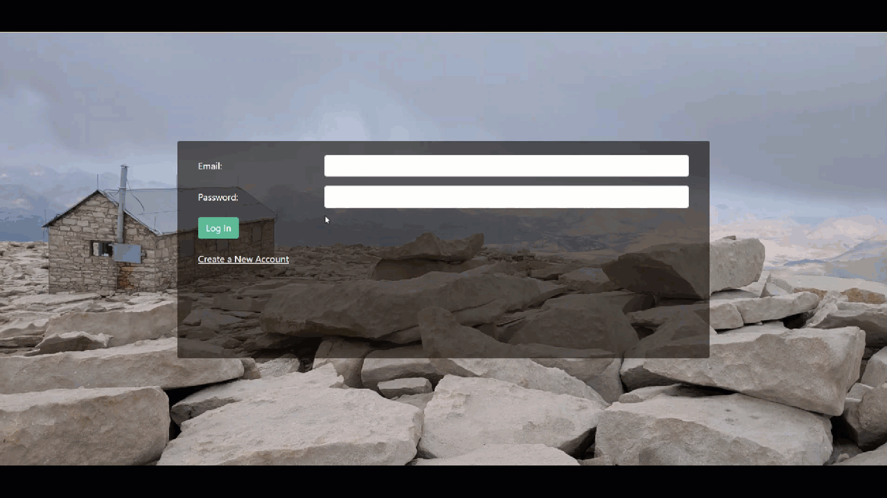
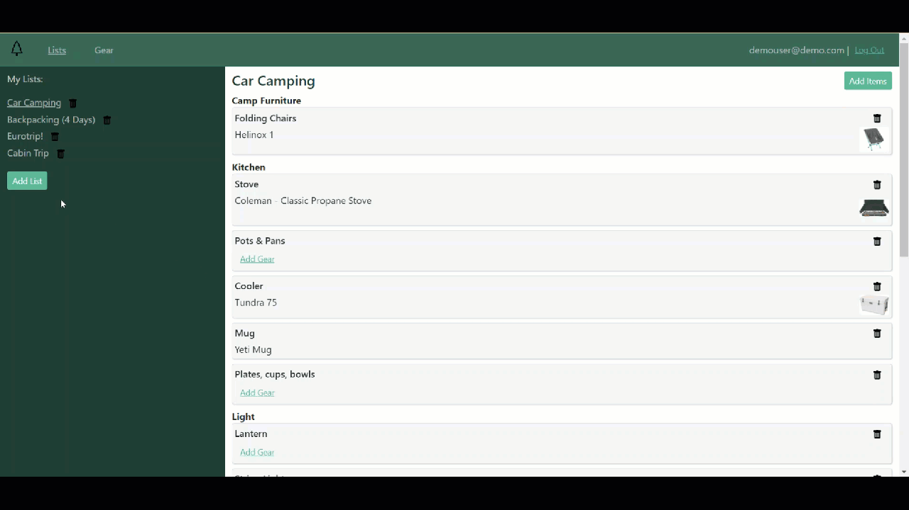
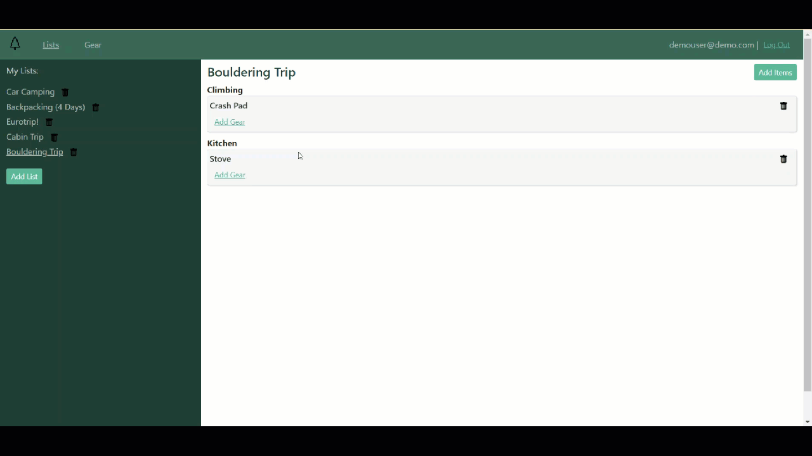
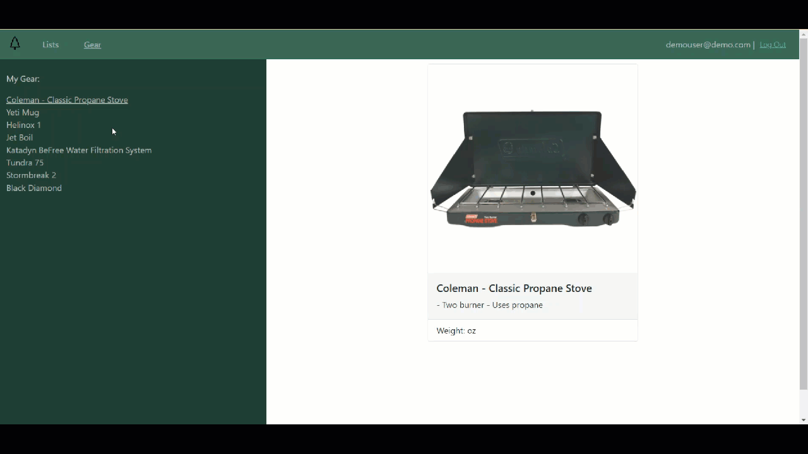

# PackMe - Packing App

PackMe is an application that allows users to create, modify and store a variety of packing lists all in one place so they can reuse them each time they take a trip. It also allows users to associate specific gear they own with the items on their list so that they can track the details of the gear they have as well as make their lists specific to whatever type of adventure they want to go on.

## Contents

-   [Features](#features)
-   [Technologies & Stack](#techandstack)
-   [Setup & Installation](#setup)

## <a name="features"></a> Features

<br>

#### User registration and login

<br>
<br>

<br>

#### Add and Edit Lists and Items

<br>
<br>

<br>

#### Select/Add Gear

<br>
<br>

<br>

#### View Gear Details

<br>
<br>

<br>

## <a name="techandstack"><a> Technologies & Stack

<br>

**Backend:** Python, Flask, SQLAlchemy, PostgreSQL<br>
**FrontEnd:** React, Javascript, Babel, ReactRouter, ReactBootstrap, HTML, CSS<br>
**API's:** Cloudinary<br>

## <a name="setup"><a> Set-Up and Installation

### Requirements

<br>
You must have installed:

-   PostgrSQL
-   Python3
-   Flask
-   FlaskSQLAlchemy
-   Cloundinary
    <br>

You will also need (included via CDN in app.html):

-   React
-   ReactRouter
-   ReactBootstrap
    <br>

### How to install

<br>

Install [Python3](https://www.python.org/downloads/mac-osx/)<br>
Install [pip](https://pip.pypa.io/en/stable/installing/), the package installer for Python<br>
Install [postgreSQL](https://www.postgresql.org/) for the relational database.<br>

Clone or fork the repository:

```
$ git clone https://github.com/singram11/packing-app.git
```

Create and activate a virtual environment within the project directory:

```
$ virtualenv env
$ source env/bin/activate
```

Install dependencies:

```
$ pip3 install -r requirements.txt
```

Make an account with [Cloudinary](https://cloudinary.com/documentation) & get your API key.

You will also need to create your own [Flask Session](https://flask-session.readthedocs.io/en/latest/) key.

Both the Cloudinary and Flask Session keys should be stored in a secrets.sh file.

```
export FLASK_SECRET_KEY="yourKeyHere"

export CLOUDINARY_KEY="yourCloudinaryKeyHere"
export CLOUDINARY_SECRET="yourCloudinarySecretHere"
```

Load the variables from your secrets.sh into your shell.

```
$ source secrets.sh
```

With PostgreSQL installed create a database to store the user information.

```
$ createdb packme
```

If you want some test users and sample data you can run the seed_database.py file.

```
$ python3 seed_database.py
```

Note: this will drop the database and recreate it with the demo information - once you have data in your DB you will not want to run this unless you want to clear the DB.

Then run the server from the command line:

```
$ python3 server.py
```
